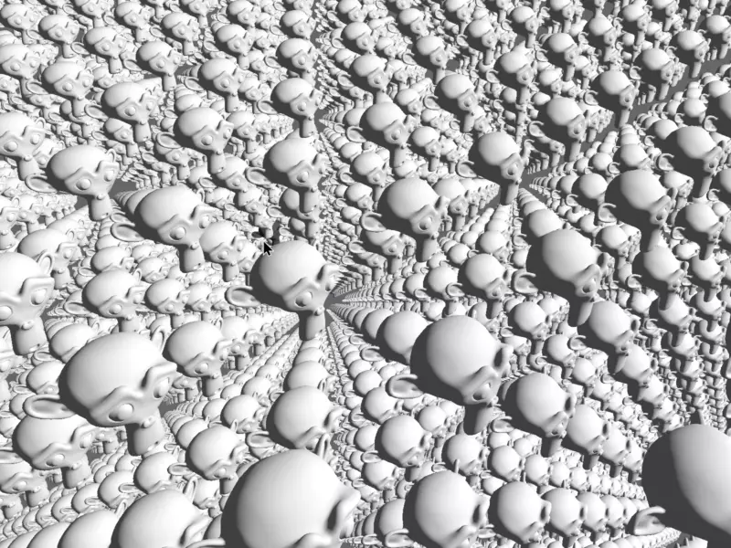

# 3D Mouse Picking for Bevy

This is a 3D mouse picking plugin for [Bevy](https://github.com/bevyengine/bevy). The plugin will cast a ray into the scene and check for intersection against all meshes tagged with the `PickableMesh` component. The built-in highlighting and selection state are opt-in.

Out of the box, the plugin provides: pick depth, pick coordinates, and surface normal of the picked mesh triangle.

**Expect Breaking Changes - Issues/PRs Welcome**



## Getting Started

To run the `3d_scene` example - a modified version of the `bevy` example of the same name - clone this repository and run:
```console
cargo run --example 3d_scene
```

## Usage

### Setup

Add the repo to your dependencies in Cargo.toml

```toml
bevy_mod_picking = { git = "https://github.com/aevyrie/bevy_mod_picking", branch = "master" }
```

Import the plugin:

```rust
use bevy_mod_picking::*;
```

Add it to your App::build() in the plugins section of your Bevy app:

```rust
.add_plugin(PickingPlugin)
```

### Marking Entities for Picking

Make sure you have your camera's entity on hand, you could do the following in your setup system:

```rust
let camera_entity = Entity::new();

// ...

.spawn_as_entity(camera_entity, Camera3dComponents {

// ...
```

Now all you have to do is mark any mesh entities with the `PickableMesh` component:

```rust
.with(PickableMesh::new(camera_entity))
```

If you want it to highlight when you hover, add the `HighlightablePickMesh` component:

```rust
.with(HighlightablePickMesh::new())
```

If you also want to select meshes and keep them highlighted with the left mouse button, add the `SelectablePickMesh` component:

```rust
.with(SelectablePickMesh::new())
```

### Getting Pick Data

#### Pick Intersections Under the Cursor

Mesh picking intersection are reported in world coordinates. You can use the `PickState` resource to either get the topmost entity, or a list of all entities sorted by distance (near -> far) under the cursor:

```rust
fn get_picks(
    pick_state: Res<PickState>,
) {
    println!("All entities:\n{:?}", pick_state.list());
    println!("Top entity:\n{:?}", pick_state.top());
}
```

#### Selection State

If you're using the `SelectablePickMesh` component for selection, you can access the selection state by querying all selectable entities and accessing the `.selected()` function.

### Plugin Parameters

If you're using the built in `HighlightablePickMash` component for highlighting, you can change the colors by accessing the `PickHighlightParams` and setting the colors:

```rust
fn set_highlight_params(
    mut highlight_params: ResMut<PickHighlightParams>,
) {
    highlight_params.set_hover_color(Color::rgb(1.0, 0.0, 0.0));
    highlight_params.set_selection_color(Color::rgb(1.0, 0.0, 1.0));
}
```

### Debug

You can also enable a debug cursor that will place a sphere at the intersection, with a tail pointing normal to the surface. Just add the `DebugPickingPlugin` to the `App::build()` in your Bevy program:

```rust
.add_plugin(DebugPickingPlugin)
```
